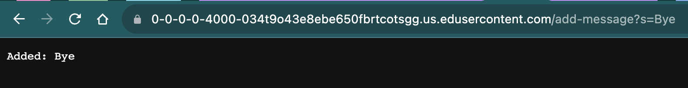
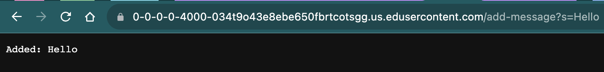
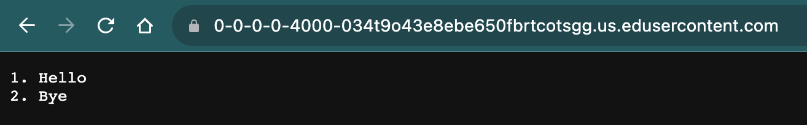

# Lab Report 2 - Servers and SSH Keys

## Part 1

### StringServer.java
```
import java.io.IOException;
import java.net.URI;
import java.util.ArrayList;

class Handler implements URLHandler {
    ArrayList<String> queries = new ArrayList<>();

    public String handleRequest(URI url) {
        if (url.getPath().equals("/")) {
            String printing = "";
            for (int i = 0; i < queries.size(); i++) {  
                String[] parameters = queries.get(i).split("\\.");  
                printing += parameters[0] + ". " + parameters[1] + "\n";
            }
            return String.format(printing);
        } else if (url.getPath().equals("/add-message")) {
            String[] parameters = url.getQuery().split("=");
            String query = Integer.toString(queries.size() + 1) + "." + parameters[1];
            queries.add(query);
            return String.format("Added: %s", parameters[1]);
        }
        return "404 Not Found!";
    }
}

class StringServer {
    public static void main(String[] args) throws IOException {
        if (args.length == 0) {
            System.out.println("Missing port number! Try any number between 1024 to 49151");
            return;
        }

        int port = Integer.parseInt(args[0]);
        Server.start(port, new Handler());
    }
}
```

### "/add-message"


The methods that are being called is handleRequest(URI url) in the class Handler. The relevant arguments to the handleRequest method is the URI object representing the input URL. For this example, the url object represents the URL (".../add-message?s=hello") and (".../add-message?s=bye"). We created an ArrayList called queries, that stores the messages. The handleRequest accesses the queries ArrayList and modifies it. The input message "hello" and "bye" are extracted from the URL and is added to the queries ArrayList as a numbered entry, thus the queries ArrayList is now queries = ["1.hello", "2.bye"]. If more requests are made, the list will grow accordingly and additional messages will be added to the queries ArrayList.

### "/"

If the url object is being called without a path, meaning if the root URL is called ("/"). The handleRequest accesses the queries ArrayList and prints out the queries by splitting each entry into two parts, index and message, and concatenating them with a period and a space, followed by a newline character. The displayed content is dynamic and changes in response to messages added using the "/add-message" path. As new messages are added using the "/add-message" link, it appends to the queries ArrayList. The list of messages saved in queries is dynamically generated when the root URL is called.

## Part 2

```
atwins@MacBook-Air-8 ~ % ssh-keygen 
Generating public/private rsa key pair.
Enter file in which to save the key (/Users/atwins/.ssh/id_rsa): 
/Users/atwins/.ssh/id_rsa already exists.
Overwrite (y/n)? y
Enter passphrase (empty for no passphrase): 
Enter same passphrase again: 
Your identification has been saved in /Users/atwins/.ssh/id_rsa
Your public key has been saved in /Users/atwins/.ssh/id_rsa.pub
The key fingerprint is:
SHA256:B9o6j9AfPJFCbjB7M6ufnSpnOMCYq0wnTRPS+4Xd1Oc atwins@MacBook-Air-8.local
The key's randomart image is:
+---[RSA 3072]----+
|                 |
|  .       .      |
| . oo . .. . .   |
|  . o*oooo  o    |
| + +..OoS..  E   |
|o = o+.B o       |
| + +.o= +        |
|+ o +ooB +       |
|o.  .*=.=        |
+----[SHA256]-----+
atwins@MacBook-Air-8 ~ % 
```

### Path to the private key for your SSH key for logging into ieng6 (on your computer)
The path to the private key is /Users/atwins/.ssh/id_rsa.

### Path to the public key for your SSH key for logging into ieng6 (within your account on ieng6)
The path to the public key is /Users/atwins/.ssh/id_rsa.pub.

### Terminal interaction where you log into ieng6 with your course-specific account without being asked for a password
```
atwins@MacBook-Air-8 ~ % ssh cs15lfa23oi@ieng6.ucsd.edu                                                     
Last login: Thu Oct 19 23:13:18 2023 from 128.54.149.96
quota: Cannot resolve mountpoint path /home/linux/dsmlp/.snapshot/daily.2023-09-19_0010: Stale file handle
quota: Cannot resolve mountpoint path /home/linux/dsmlp/.snapshot/daily.2023-10-01_0010: Stale file handle
quota: Cannot resolve mountpoint path /home/linux/dsmlp/.snapshot/hourly.2023-09-29_2001: Stale file handle
Hello cs15lfa23oi, you are currently logged into ieng6-203.ucsd.edu

You are using 0% CPU on this system

Cluster Status 
Hostname     Time    #Users  Load  Averages  
ieng6-201   23:15:01   2  2.41,  2.22,  1.61
ieng6-202   23:15:01   7  0.70,  0.40,  0.27
ieng6-203   23:15:01   5  4.29,  4.19,  3.82

 
Thu Oct 19, 2023 11:16pm - Prepping cs15lfa23
[cs15lfa23oi@ieng6-203]:~:32$ 
```

## Part 3
Something that I learned during weeks 2 and 3, that I did not know before, was about the components of URLs. I now understand how web addresses are structured with domain names, paths, query parameters, and fragment identifiers and how to use handlers to interact with them. In addition, I learned about Secure Shell (SSH) protocol, which allows secure access to servers on different computers over a network. While I did know that servers can be accessed remotely, I did not know how to do it, this can be beneficial in remote collaboration and server management. 
