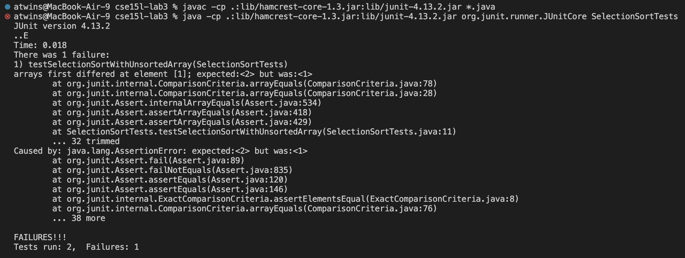
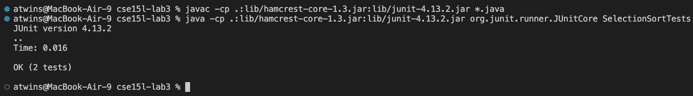

# Lab Report 3 - Bugs and Commands

## Part 1 - Bugs

My program is the Selection Sort algorithm, it takes in an array of integers and outputs the array sorted in increasing order.
```
public class SelectionSort {
    static void selectionSort(int[] arr) {
        for (int i = 0; i < arr.length; i += 1) {
            int minIndex = i;
            for (int j = i; j < arr.length; j += 1) {
                if (arr[j] < arr[minIndex]) {
                    minIndex = j;
                }
            }
            // Swap the minimum element with the first element
            if (i != minIndex) {
                arr[i] = arr[minIndex];
                arr[minIndex] = arr[i];
            }
        }
    }
}
```

In order to test my algorithm, I wrote some JUnit tests. I tested to see if the sorting algorithm works on an unsorted and sorted array.
```
@Test
public void testSelectionSortWithUnsortedArray() {
    int[] input = {4, 2, 7, 1, 9, 3};
    int[] expectedOutput = {1, 2, 3, 4, 7, 9};
    SelectionSortExamples.selectionSort(input);
    assertArrayEquals(expectedOutput, input);
}

@Test
public void testSelectionSortWithSortedArray() {
    int[] input = {1, 2, 3};
    int[] expectedOutput = {1, 2, 3};
    SelectionSortExamples.selectionSort(input);
    assertArrayEquals(expectedOutput, input);
}
```

However, one of these test cases do not pass. 


The symptom that is occuring is that testSelectionSortWithUnsortedArray test case passes successfully without any errors, but testSelectionSortWithSortedArray test case does not pass.

The bug in the SelectionSort method was due to incorrect swapping logic. After selecting the index of the minimum index, you swap the minimum element with the element at the current index i, if they are not the same. Thus, we replace the value of the element at index i with the value of the element at the minimum index. However, we do not store the original value of element at index i, meaning that it is being overridden. This means that incorrect elements are being swapped, leading to unexpected behavior.

In order to fix this, I created a temp variable that stored the orignal value of the element at index i, before swapping. Thus, when we reassign the element at minIndex to the element at i, we can do so with the temp variable. This ensures no elements are lost and the correct swapping occurs and the bug is fixed. Here is the corrected version of the code.
```
public class SelectionSort {
    static void selectionSort(int[] arr) {
        for (int i = 0; i < arr.length; i++) {
            int minIndex = i;
            for (int j = i; j < arr.length; j++) {
                if (arr[j] < arr[minIndex]) {
                    minIndex = j;
                }
            }
            // Swap the minimum element with the first element
            if (i != minIndex) {
                int temp = arr[i];
                arr[i] = arr[minIndex];
                arr[minIndex] = temp;
            }
        }
    }
}
```

The JUnit tests pass as well.


## Part 2 - Researching Commands

### *grep [-option] pattern [file]*
The *grep* command, searches a file for the specified pattern, and displays all lines that contain that pattern.

#### *-n* line number
The *-n* option prefixes each line of the matching output with the line number in the input file. 

##### Examples:
This searches and returns all lines in the pmed.0020281.txt file that contain "whistleblow", it outputs all these lines with the line number. This is useful when you are searching for something in a large file, so you do not have to search through every line.
```
atwins@MacBook-Air-9 cse15l-docsearch % grep -n "whistleblow" technical/plos/pmed.0020281.txt                                    
7:        whistleblowing—as discussed, in part, in 
17:        For me, whistleblowing is not a theoretical exercise. It has a human face and tangible
23:        In the lonely and, at times, discouraging world of whistleblowing, we whistleblowers are
27:        might make. Truth is the basis for the power of a whistleblower, one that can withstand the
30:        A whistleblower's success depends upon competent and articulate media. The debate to
37:        this is to have succeeded [s a whistleblower].”
```

This searches and returns all lines in two files, the pmed.0020257.txt file and pmed.0020278.txt file that contains "aids", it outputs all these lines with the file name and the line number. The *-i* command makes it case insensitive, so it will match both uppercase and lowercase variations of the pattern. This is useful when you are searching for something in a large file, so you do not have to search through every line. 
```
atwins@MacBook-Air-9 cse15l-docsearch % grep -ni "aids" technical/plos/pmed.0020257.txt technical/plos/pmed.0020278.txt 
technical/plos/pmed.0020257.txt:6:        People living with HIV/AIDS (PLWA) face many forms of stigma and discrimination. This is
technical/plos/pmed.0020257.txt:17:        adult Nigerians are thought to be HIV-positive, and there will be an estimated 310,000 AIDS
technical/plos/pmed.0020257.txt:19:        has been known about the nature and extent of discrimination against patients with HIV/AIDS
technical/plos/pmed.0020257.txt:26:        reported refusing to care for a patient with HIV/AIDS, and 9% said they had refused a
technical/plos/pmed.0020257.txt:27:        patient with HIV/AIDS admission to a hospital. Fifty-nine percent agreed that PLWA should
technical/plos/pmed.0020257.txt:31:        professionals with HIV/AIDS should not be allowed to work in any area of health-care
technical/plos/pmed.0020257.txt:32:        requiring patient contact. Twenty percent agreed that many with HIV/AIDS had behaved
technical/plos/pmed.0020257.txt:34:        HIV/AIDS was a waste of resources.
technical/plos/pmed.0020257.txt:38:        not sufficiently available. Providers who reported less adequate training in HIV/AIDS
technical/plos/pmed.0020257.txt:40:        HIV/AIDS. There was no consistent pattern of differences in negative attitudes and
technical/plos/pmed.0020257.txt:44:        towards patients with HIV/AIDS existed among a significant proportion. Inadequate education
technical/plos/pmed.0020257.txt:45:        about HIV/AIDS and a lack of protective and treatment materials appear to favor these
technical/plos/pmed.0020278.txt:13:        of a quarter-century of primate research on AIDS to provide any useful insights; the false
technical/plos/pmed.0020278.txt:21:        Recall that VaxGen's AIDS vaccine (AIDSVAX) showed great success in primate studies, but
technical/plos/pmed.0020278.txt:25:        Consider the fruitless decades-long effort to produce an AIDS vaccine in primates, the
technical/plos/pmed.0020278.txt:26:        failure to produce even a single case of human AIDS in any primate studied, or the failure
technical/plos/pmed.0020278.txt:27:        to identify even one useful AIDS drug from primate studies. Genetic and physiological
```

#### *-v* invert match
The *-v* command returns all the non-matching lines of the input pattern.

##### Examples:
This searches and returns all the lines that do not contain the pattern "NEADS". This can be useful if you want to filter something out, for this example, this was a transcription of a 911 call between NEADS and the FAA and I only wanted the lines said by the FAA.
```
atwins@MacBook-Air-9 cse15l-docsearch % grep -v "NEADS" technical/911report/chapter-1.txt
FAA: Yes.
FAA: That was another-it was evidently another aircraft that hit the tower. That's the latest report we have.
FAA: I'm going to try to confirm an ID for you, but I would assume he's somewhere over, uh, either New Jersey or somewhere further south.
FAA: Yes.
FAA: Yes. This could be a third aircraft.
```

This searches and returns all lines that do not contain the specified pattern. The ^ symbol excludes all lines that start with the pattern. For this example, I excluded any line that starts with "I", so that the chapter names do not get returned.
```
atwins@MacBook-Air-9 cse15l-docsearch % grep -v "^I" technical/government/About_LSC/CONFIG_STANDARDS.txt

STATE PLANNING CONFIGURATION STANDARDS Final Task Force Report
- Board Approved
November 2001
LEGAL SERVICES CORPORATION

STATE PLANNING CONFIGURATION STANDARDS
Final Task Force Report - Board Approved

This document-- Legal Services Corporation State Planning
Configuration Standards -- presents in one place a comprehensive
compilation of the standards LSC recipients and Designated State
Planning Bodies (DSPB's)1 should consider and that the Legal
Services Corporation will use in considering the configuration of a
state's legal services delivery system.2
Determination of the most appropriate configuration of programs
in a given state is a part of the broader state planning process
and cannot be divorced from consideration of the overall goals of
the state delivery system, the state's past performance, current
status, and progress towards and plans for achieving those goals.
The Legal Services Corporation expects its grantees in each state
and territory to work with one another and with a broad spectrum of
other equal justice stakeholders3 to develop comprehensive,
integrated statewide civil legal services delivery systems which
are responsive to the most compelling needs of eligible clients and
client communities, ensure the highest and most strategic use of
all available resources, maximize the opportunity for clients
throughout the state to receive timely, effective and appropriate
legal services in the present and in the future, and operate
efficiently and effectively.4
1 A "Designated State Planning Body" is an entity that has been
established and charged with responsibility for coordinating state
legal services delivery planning. Such planning entities are
generally composed of an array of civil equal justice delivery
stakeholders, including but not limited to representatives from the
state bar association, state IOLTA funding entity, staffed legal
services programs (LSC and non-LSC), the pro bono community, client
organizations, clients and others with an interest and commitment
to effective delivery of civil legal services to poor and
vulnerable people in the state.
2 For LSC's policies regarding internal review of configuration
recommendations, see Legal Services Corporation Reconfiguration
Review Process, September 21, 2001.
3 State planning processes, including the participants, will
vary from state to state, and LSC does not require the same process
or participation in each state. However, LSC continues to encourage
broad civil equal justice stakeholder participation at the state
level and expects its grantees to do the same.
4 For a fuller articulation of these goals, see LSC Program
Letters 98-1, 98-6, and 2000-7, and Strategic Directions 2000-2005,
adopted by the LSC Board of Directors on January 28, 2000.
While LSC will continue to utilize a variety of approaches, LSC
views service area configuration as a key structural component of a
comprehensive set of strategies employed to promote the creation
and sustainability of comprehensive, integrated state civil equal
justice communities. LSC has and will continue to require its
grantees and encourage DSPB's to critically examine the degree to
which the configuration of LSC grantees in any given state promotes
these ends.
```

#### *-L* files without match
The *-L* command prints the name of each input file from which no output would have been matched.

##### Examples:
This searches and returns all the file names that do not contain the word cell. The **.txt* means it will search all the *.txt* files under the biomed directory.   This can be used to filter out files that are not needed.
```
atwins@MacBook-Air-9 cse15l-docsearch % grep -L "cell" technical/biomed/*.txt
technical/biomed/1468-6708-3-10.txt
technical/biomed/1468-6708-3-4.txt
technical/biomed/1471-2091-3-17.txt
technical/biomed/1471-2105-2-9.txt
technical/biomed/1471-2148-2-15.txt
technical/biomed/1471-2148-2-5.txt
technical/biomed/1471-2148-2-7.txt
technical/biomed/1471-2148-3-1.txt
technical/biomed/1471-2156-3-10.txt
technical/biomed/1471-2156-4-10.txt
technical/biomed/1471-2164-3-24.txt
technical/biomed/1471-2164-3-27.txt
technical/biomed/1471-2261-3-5.txt
technical/biomed/1471-2288-1-9.txt
technical/biomed/1471-2288-2-10.txt
technical/biomed/1471-2288-2-11.txt
technical/biomed/1478-7954-1-3.txt
technical/biomed/ar319.txt
technical/biomed/ar387.txt
technical/biomed/ar750.txt
technical/biomed/ar93.txt
technical/biomed/bcr458.txt
technical/biomed/cc1498.txt
technical/biomed/cc1529.txt
technical/biomed/cc1538.txt
technical/biomed/cc1856.txt
technical/biomed/cc1882.txt
technical/biomed/cc2171.txt
technical/biomed/cc2172.txt
technical/biomed/cc2358.txt
technical/biomed/cc3.txt
technical/biomed/cc350.txt
technical/biomed/cc4.txt
technical/biomed/cc973.txt
technical/biomed/cc991.txt
technical/biomed/cvm-2-4-180.txt
technical/biomed/cvm-2-4-187.txt
technical/biomed/gb-2001-2-8-research0027.txt
technical/biomed/gb-2002-3-11-research0065.txt
technical/biomed/gb-2002-3-12-research0082.txt
technical/biomed/gb-2002-3-12-research0086.txt
technical/biomed/gb-2002-3-9-research0049.txt
technical/biomed/gb-2003-4-6-r41.txt
technical/biomed/rr196.txt
technical/biomed/rr37.txt
```

This searches and returns, recursively, all the files under the biomed directory for files that do not contain "Backgroud". For this example, this returns all files that do not contain background information, which could be useful for someone who does not want to read background information.
```
atwins@MacBook-Air-9 cse15l-docsearch % grep -r -l "Background" technical/biomed 
technical/biomed/1472-6807-2-2.txt
technical/biomed/1471-2350-4-3.txt
technical/biomed/1471-2156-2-3.txt
technical/biomed/1471-2156-3-11.txt
technical/biomed/1471-2121-3-10.txt
technical/biomed/1471-2172-3-4.txt
technical/biomed/gb-2002-4-1-r2.txt
technical/biomed/1471-2407-3-18.txt
technical/biomed/1471-2229-2-3.txt
technical/biomed/1471-2334-1-9.txt
technical/biomed/gb-2002-3-9-research0043.txt
technical/biomed/1471-2415-3-5.txt
technical/biomed/1471-2334-1-21.txt
technical/biomed/gb-2001-2-7-research0025.txt
technical/biomed/1476-069X-2-7.txt
technical/biomed/gb-2002-3-7-research0032.txt
technical/biomed/1471-2253-2-5.txt
technical/biomed/1471-2210-1-10.txt
technical/biomed/gb-2001-2-3-research0008.txt
technical/biomed/1471-2156-2-1.txt
technical/biomed/1471-2466-3-1.txt
technical/biomed/gb-2003-4-7-r46.txt
technical/biomed/1475-2875-2-14.txt
technical/biomed/1471-2288-2-4.txt
technical/biomed/1471-2334-1-24.txt
technical/biomed/1471-2377-2-4.txt
technical/biomed/gb-2002-3-9-research0046.txt
technical/biomed/gb-2002-3-7-research0037.txt
technical/biomed/gb-2001-2-8-research0027.txt
technical/biomed/1476-069X-2-2.txt
technical/biomed/1471-2148-2-15.txt
technical/biomed/1471-2210-1-8.txt
technical/biomed/1471-2091-3-8.txt
technical/biomed/1472-6793-2-8.txt
technical/biomed/1471-2156-3-16.txt
technical/biomed/gb-2003-4-7-r43.txt
technical/biomed/1472-6807-2-5.txt
technical/biomed/1471-2350-4-4.txt
technical/biomed/1471-2172-1-1.txt
technical/biomed/1471-2350-4-6.txt
technical/biomed/1471-2121-3-15.txt
technical/biomed/1471-2172-3-1.txt
technical/biomed/1472-6904-2-4.txt
technical/biomed/1472-6750-1-11.txt
technical/biomed/gb-2003-4-5-r30.txt
technical/biomed/gb-2002-3-9-research0051.txt
technical/biomed/1471-2415-3-3.txt
technical/biomed/gb-2002-3-9-research0045.txt
technical/biomed/gb-2001-2-8-research0030.txt
technical/biomed/1472-6769-1-3.txt
technical/biomed/1471-2180-2-32.txt
technical/biomed/1471-2202-4-16.txt
technical/biomed/1471-2180-2-26.txt
technical/biomed/1471-2431-2-4.txt
technical/biomed/1471-2458-3-2.txt
technical/biomed/1475-9276-1-3.txt
technical/biomed/1472-6815-2-3.txt
technical/biomed/1471-2458-2-11.txt
technical/biomed/gb-2001-2-6-research0020.txt
technical/biomed/1472-6785-2-7.txt
technical/biomed/1472-6890-3-2.txt
technical/biomed/1471-2202-2-16.txt
technical/biomed/gb-2002-3-12-research0083.txt
technical/biomed/1471-2180-3-13.txt
technical/biomed/1471-2210-2-8.txt
technical/biomed/1472-6793-1-8.txt
technical/biomed/gb-2003-4-1-r5.txt
technical/biomed/1471-2334-2-24.txt
technical/biomed/1471-2318-3-2.txt
technical/biomed/1471-2156-2-12.txt
technical/biomed/1471-2180-1-31.txt
technical/biomed/gb-2002-3-12-research0071.txt
technical/biomed/1471-2180-1-33.txt
technical/biomed/gb-2000-1-1-research002.txt
technical/biomed/gb-2001-3-1-research0005.txt
technical/biomed/1471-2091-4-1.txt
technical/biomed/gb-2003-4-1-r7.txt
technical/biomed/1471-2334-2-26.txt
technical/biomed/1471-2121-2-11.txt
technical/biomed/1471-2105-3-18.txt
technical/biomed/1471-2261-3-5.txt
technical/biomed/1476-5918-1-2.txt
technical/biomed/1472-6963-3-13.txt
technical/biomed/1471-2164-3-1.txt
technical/biomed/1471-2202-3-1.txt
technical/biomed/1471-2210-2-4.txt
technical/biomed/1471-2199-3-10.txt
technical/biomed/1471-2350-2-12.txt
technical/biomed/1471-2350-3-9.txt
technical/biomed/1475-9268-1-1.txt
technical/biomed/1471-2334-3-15.txt
technical/biomed/1471-2148-1-4.txt
technical/biomed/gb-2002-3-10-research0056.txt
technical/biomed/1472-6947-3-5.txt
technical/biomed/1471-213X-1-12.txt
technical/biomed/1471-2148-3-4.txt
technical/biomed/1471-2458-3-11.txt
technical/biomed/1475-2875-1-5.txt
technical/biomed/1477-7827-1-31.txt
technical/biomed/gb-2002-3-3-research0011.txt
technical/biomed/gb-2002-3-10-research0054.txt
technical/biomed/1471-2148-1-6.txt
technical/biomed/1471-2202-4-3.txt
technical/biomed/1472-6947-1-5.txt
technical/biomed/1471-2202-2-5.txt
technical/biomed/1476-9433-1-2.txt
technical/biomed/1471-2210-1-2.txt
technical/biomed/1472-6793-2-2.txt
technical/biomed/1471-2156-4-9.txt
technical/biomed/1471-2431-2-12.txt
technical/biomed/1471-2210-3-1.txt
```

#### *-c* word count
The *-c* command returns the number of times the pattern appears in the file.

##### Examples:
This searches and returns the number of times the "Barnes" appears in the file. This can be useful when you are looking for the number of times something occured in a file.
```
atwins@MacBook-Air-9 cse15l-docsearch % grep -c "Barnes" technical/government/Media/Barnes_pro_bono.txt
14
```

This searches and returns the number of times "Boone" and "Schroeder" occurs in the file. The -e command allows you to search for multiple patterns. This can be useful if you are searching for how many times multiple patterns occur in a file.
```
atwins@MacBook-Air-9 cse15l-docsearch % grep -c -e "Boone" -e "Schroeder" technical/government/Media/Boone_legal_service.txt
13
```

A lot of the terminal outputs were reduced, in order to not make this documane too long.
#### Citations
- https://www.freecodecamp.org/news/grep-command-in-linux-usage-options-and-syntax-examples/
- https://man7.org/linux/man-pages/man1/grep.1.html
- *man grep* command