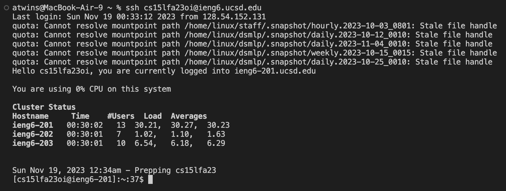
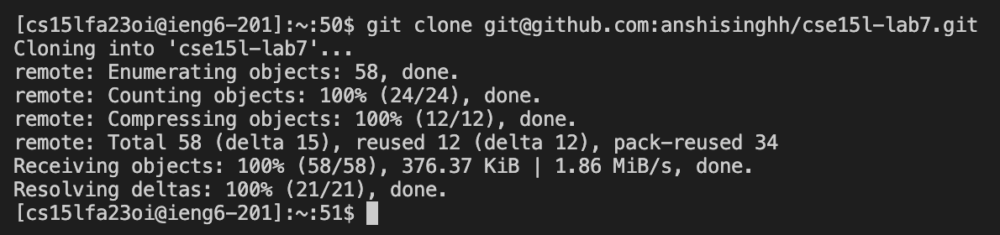
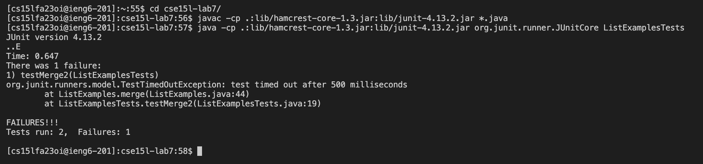
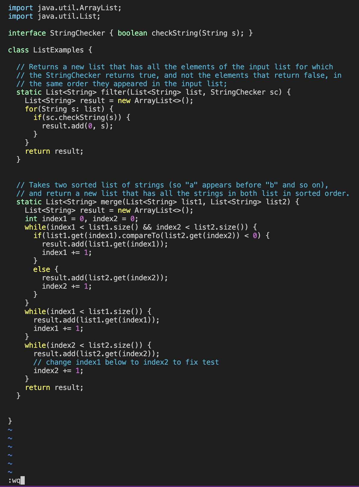
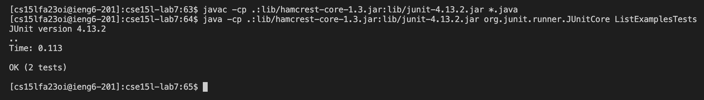
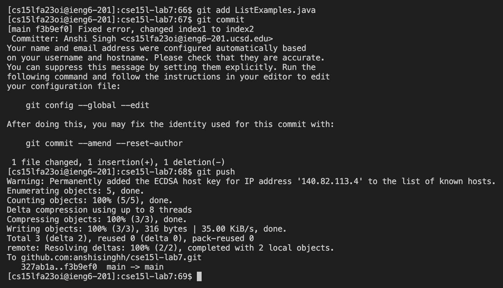

# Lab Report 4 - Vim

## Log into ieng6
In order to log into the ieng6 server, I opened my terminal and typed in the command ```ssh cs15lfa23oi@ieng6.ucsd.edu``` then I pressed the ```enter``` key which logged me into my ieng6 server. I did not have to enter my password to log into my remote server because I had generated SSH keys in the previous week.


## Clone your fork of the repository from your Github account (using the SSH URL)
In order to clone my fork of the repository from my Github account, I went to my forked Github repository on the Github website, then I copied my repository using the SSH url. Then I went to my terminal and typed the command ```git clone``` followed by the SSH url. Then I pressed the ```enter``` key, which then ran the command and cloned my repository.


## Run the tests, demonstrating that they fail
In order to run the tests, I had to navigate into the project directory using the command *cd cse15l-lab7/* in the terminal, then pressing the ```enter``` key to run it. Then I used ```javac -cp .:lib/hamcrest-core-1.3.jar:lib/junit-4.13.2.jar *.java``` and ```java -cp .:lib/hamcrest-core-1.3.jar:lib/junit-4.13.2.jar org.junit.runner.JUnitCore ListExamplesTests``` to run the test files, and pressing the ```enter``` command after each one to run it. 


## Edit the code file to fix the failing test
In order to access the code file, in the terminal, I ran the command ```vim ListExamples.java```, and then ```enter```.
Keys pressed: ```</index1><enter>``` This command found the first instance of “index1” and then to navigate to the one we want to change, I used the n and l keys, ```<n><n><n><n><n><n><n><n><n><l><l><l><l><l>```. After having your cursor on the 1, in order to delete the 1, press ```<x>``` and insert a 2 instead, ```<i><2><esc>```. Then save and exit from vim using ```<:wq>```.


## Run the tests, demonstrating that they now succeed
In order to run the tests and demonstrate they succeed. 
Keys pressed: ```<up><up><up><up><up><up><enter>```, ```<up><up><up><up><up><enter>``` The ```javac -cp .:lib/hamcrest-core-1.3.jar:lib/junit-4.13.2.jar *.java``` command was 6 up in the search history since we called it before, so I used up arrow to access it. Then the ```java -cp .:lib/hamcrest-core-1.3.jar:lib/junit-4.13.2.jar org.junit.runner.JUnitCore ListExamplesTests``` command was also 6 up in the history, so I accessed and ran it in the same way by pressing the ```enter``` key.


## Commit and push the resulting change to your Github account (you can pick any commit message!)
In order to commit and push the wrestling change to my Github account, I used the ```git add ListExamples.java``` command and pressed the ```enter``` key. The git add command adds a change in the ListExamples.java file to the staging area. Then, I typed the command ```git commit```, which records changes to the repository. In order to commit a change, you need to insert a commit message, after typing the command, a Vim editor opens up I pressed ```<i>``` to insert a message and wrote the message “Fixed error, changed index1 to index2” which I saved using the command ```<:wq>```. Thus, the changes are now recorded with the error message. So then, I typed the command ```git push``` and then ```enter``` in my terminal, which updates those changes in my Github repository.



