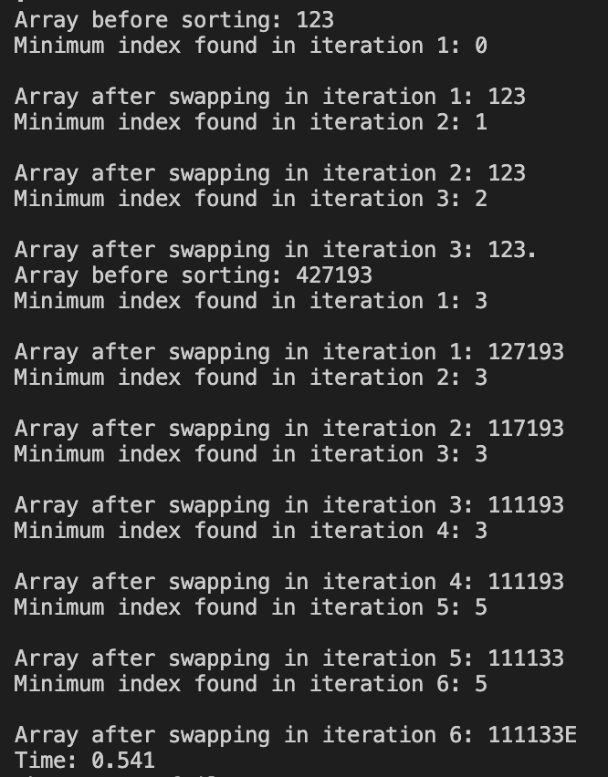

# Lab Report 5 - Putting it All Together

## Part 1 - Debugging Scenario

### Orignal Student Post
Hey everyone, I've been working on a selection sort algorithm in Java, and I’m having a weird issue that I cannot figure out. The code compiles fine, but when I run it, the array doesn't seem to be sorted correctly. I attached a screenshot of the code and the output after running it for two sample cases, it works when the array is sorted but not when it is unsorted. I think the bug might be in the swapping part, but I'm not sure. Any help is appreciated!


### TA Response
Hi there! Thanks for sharing your code and the output. It looks like you're on the right track suspecting the swapping part. Pay attention to the values of arr[i] and arr[minIndex] during the swap, you can set breakpoints or use print statements to see what values are being assigned. Let me know if that helps!

### Student's Follow-Up Response
Thanks for the suggestion! I ran the program in debug mode with the enhanced debug output, and here is what the output was. 



The bug in the selection sort algorithm was due to incorrect swapping logic. After selecting the index of the minimum index, you swap the minimum element with the element at the current index i, if they are not the same. Thus, we replace the value of the element at index i with the value of the element at the minimum index. However, we do not store the original value of element at index i, meaning that it is being overridden. This means that incorrect elements are being swapped,leading to unexpected behavior.
In order to fix this, I created a temp variable that stored the orignal value of the element at index i, before swapping. Thus, when we reassign the element at minIndex to the element at i, we can do so with the temp variable. This ensures no elements are lost and the correct swapping occurs and the bug is fixed. Here is the corrected version of my code.


The file and directory structure to write, run, and test my algorithm was:
```
- selectionSort
    - selectionSort.java
    - selectionSortTests.java
    - test.sh
```
Here are the contents of each of the files.
selectionSort.java (BEFORE)
```
public class SelectionSort {
    static void selectionSort(int[] arr) {
        for (int i = 0; i < arr.length; i += 1) {
            int minIndex = i;

            for (int j = i; j < arr.length; j += 1) {
                if (arr[j] < arr[minIndex]) {
                    minIndex = j;
                }
            }

            // Swap the minimum element with the first element
            if (i != minIndex) {
                arr[i] = arr[minIndex];
                arr[minIndex] = arr[i];
            }
        }
    }
}
```

selectionSort.java (AFTER)
```
public class SelectionSort {
    static void selectionSort(int[] arr) {
        for (int i = 0; i < arr.length; i++) {
            int minIndex = i;
            for (int j = i; j < arr.length; j++) {
                if (arr[j] < arr[minIndex]) {
                    minIndex = j;
                }
            }
            // Swap the minimum element with the first element
            if (i != minIndex) {
                int temp = arr[minIndex];
                arr[minIndex] = arr[i];
                arr[i] = temp;
            }
        }
    }
}
```

selectionSortTests.java
```
import org.junit.Test;
import static org.junit.Assert.assertArrayEquals;

public class SelectionSortTests {

    @Test
    public void testSelectionSortWithUnsortedArray() {
        int[] input = {4, 2, 7, 1, 9, 3};
        int[] expectedOutput = {1, 2, 3, 4, 7, 9};
        SelectionSort.selectionSort(input);
        assertArrayEquals(expectedOutput, input);
    }

    @Test
    public void testSelectionSortWithSortedArray() {
        int[] input = {1, 2, 3};
        int[] expectedOutput = {1, 2, 3};
        SelectionSort.selectionSort(input);
        assertArrayEquals(expectedOutput, input);
    }
}
```

test.sh
```
set -e
javac -cp .:lib/hamcrest-core-1.3.jar:lib/junit-4.13.2.jar *java
java -cp .:lib/hamcrest-core-1.3.jar:lib/junit-4.13.2.jar org.junit.runner.JUnitCore SelectionSortTests
```

## Part 2 - Reflection
In the second part of this quarter, I found it to be super helpful when we learned how to use Vim. Vim's command-line interface allows for efficient text editing without the need for an IDE, which is helpful when needing to make small edits. Not only did this streamline small edits, but it also significantly clarified my understanding of Git commands like commit, making version control in the terminal far less confusing, as before I did not know how to use it so I did all my Git commands through Github Desktop which can be slow at times.